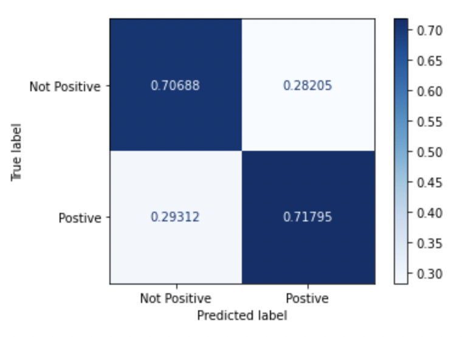

# SentimentAnalysisProject


## Project Overview
In a world where technology startups are plentiful, consumer sentiment towards a brand can give us a lot of insights into their purchasing decisions, hence the financial performance of the company that makes them. Technology investment company WhiteOre have acquired our services to build them a predictive model that monitors recent tweets on technology products to help them make informed investment decisions. WhiteOre wants a generalizable model to gauge sentiment across different brands, to act as a filtering system to help decide which brands to investigate further for possible investment. WhiteOre only cares about whether people have positive emotions towards the brand because people buy things they like.

For this project, we used advanced supervised modeling process and natural language processing to solve a tweet sentiment classification problem using an advanced dataset.

## Data Overview
The dataset comes from CrowdFlower via data.world. Human raters rated the sentiment in over 9,000 Tweets as positive, negative, or neither. The tweets included are sent out during the South by South West conference, mostly about Google and Apple products that was put together in 2013.

data source: https://data.world/crowdflower/brands-and-product-emotions

## Methodology
NLP:
- To prepare this data for modeling we decided to utilize natural language processing techniques such as removing NLTK’s stopwords, mentions (@username), the hashtag symbol (#), hyperlinks, html formatting, and non-English characters and the two most popular words, “SXSW” and “link”. Furthermore, we transformed the words into lower case, lemmatized and tokenized the words to develop a more accurate accounting of words for analysis. To vectorize the data set for modeling we used Sci-Kit Learn’s Term Frequency, Inverse Document Frequency (TF-IDF) and CountVectorizer packages. 

Target Engineering:
- We engineered our target into two classes: tweets with positive sentiment and tweets without positive sentiment, which includes neutral, negative and indistinguishable sentiments. We only care about whether the tweet is positive because positive emotion drives sales, which can translate into return on investment.

Modeling:
- For modeling techniques, we used Sci-Kit Learn’s Logistic Regression, with Primary Component Analysis(limits multicollinearity), Multinomial Naïve Bayes(good for text classification), Random Forest(more advanced algorithm) libraries and Keras’s Sequential neural network builder(Deep learning algorithm). We adjusted the max document frequency, min document frequency and max features hyperparameters for TF-IDF. We adjusted the Laplace smoothing alpha in the Multinomial Naïve Bayes Model. In the Neural Network, we added two hidden layers, two dropout sets and regularized the hidden layers’ weights, biases, and activation functions. We decided to use a TF-IDF tuned Multinomial Naïve Bayes Model because the model was not over fit and had a lower computational cost than the other models.

## Model Result
We are able to achieve 71% accuracy on both training data and testing data on both our naive bayes and neural network models without overfitting. However, naive bayes requires significantly less computational power so we decide to use naive bayes as our final model.


## Presentation
<a href="https://docs.google.com/presentation/d/12Tb1ed2SbGphrxCsO1BT1f8iac0difPph5i04wmmpwE/edit#slide=id.gfc5f0eb8fb_0_0">Link to Google Slides</a>

## Authors
- Ely Lin
- Garrett Williams
- Dave McKinley

## Repository Navigation
```
├── image
├── notebooks
│         ├──Dave
│         ├──Ely
│         └──Garrett
├── README.md
├── Tweet Sentiment for Investment.pdf
└── SentimentAnalysis.ipynb
```
